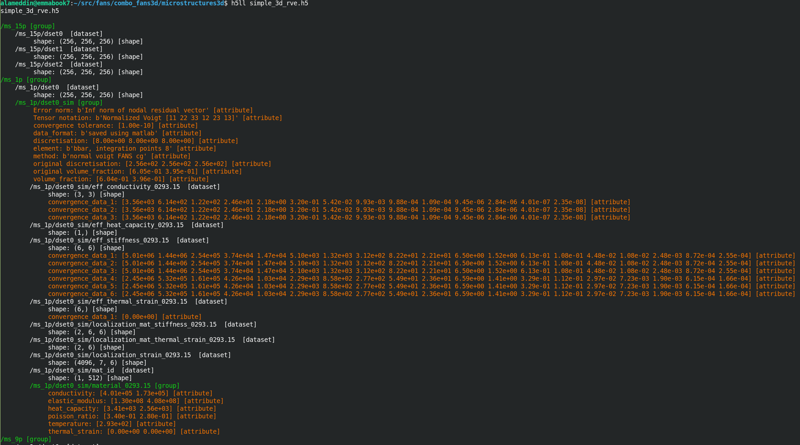

# Thermoelastic simulations of 3d microstructures

This repository acts as an extension and data source to the adaptive thermomechanical homogenization scheme implemented in https://github.com/DataAnalyticsEngineering/AdaptiveThermoMechROM. Here, image data of 3D microstructures with various oriented and shaped cuboids, spheroids, and variable volume fractions is provided by Julian Lißner.

Temperature-dependent thermoelastic effective properties are computed and stored in one single hdf5 file, for each RVE, based on finite element simulations using a Fourier accelerated nodal solver code provided by Sanath Keshav.

The microstructure is defined with a representative volume element (RVE) with periodic boundary conditions. Further details are provided in the github repo.

## Details & how to use?
- Each `*.h5` file contain a RVE and its corresponding effective properties with the a structure similar to what is shown in the image below
  
  As illustrated above, for each dataset starting with `dset`, the dataset itself such as `dset0` contains the image/microstructure data then `dset0_sim` contains all relevant simulation results and metadata such as volume fraction, convergence tolerance and so on.
  
- `gen_xdmf.py` is used to generate `*.xdmf` files that can be opened using Paraview to visualize the microstructures.
  
- `h5ll.py` is used as `python h5ll.py hdf5_file.h5` or `python h5ll.py hdf5_file.h5/group0` to investigate the content of the hdf5 file, as illustrated in the image above

## Contributors:
- Shadi Alameddin
- Julian Lißner
- Sanath Keshav
- Felix Fritzen

## Acknowledgments
- The IGF-Project with the IGF-No.: 21079 N / DVS-No.: 06.3341 of the “Forschungsvereinigung Schweißen und verwandte Verfahren e. V.” of the German Welding Society (DVS), Aachener Str. 172, 40223 Düsseldorf was funded by the Federal Ministry for Economic Affairs and Climate Action (BMWK) via the German Federation of Industrial Research Associations (AiF) in accordance with the policy to support the Industrial Collective Research (IGF) on the basis of a decision by the German Bundestag. Furthermore, the authors gratefully acknowledge the collaboration with the members of the project affiliated committee regarding the support of knowledge, material and equipment over the course of the research.

- Contributions by Felix Fritzen are partially funded by Deutsche Forschungsgemeinschaft (DFG, German Research Foundation) under Germany’s Excellence Strategy - EXC 2075 – 390740016.
Felix Fritzen is funded by Deutsche Forschungsgemeinschaft (DFG, German Research Foundation) within the Heisenberg program DFG-FR2702/8 - 406068690. 

- The authors acknowledge the support by the Stuttgart Center for Simulation Science (SimTech).